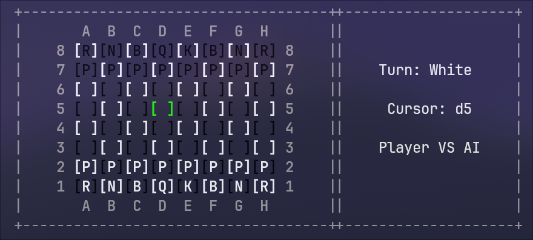

# ChessAI
A chess AI built in Go using bitboards!



# Description

This is my take on creating a minimax chess AI in Go. I have built this before in Python and C#, but those were slow, so I'm trying to make it again in Go (since it should be faster).
I did quite a bit of research on how I could get the maximum amount of output within little to no time of computing (since minimax involves a lot of recursion, it would take a while to find a move with a depth of 5). I learned that I could use bitboards, which is just a `uint64` that holds positions of chess pieces (i.e. 1 == piece, 0 == no piece).
I worked with Claude on helping me visualize piece movement. After a while, I started working through it and got some pretty quick piece generation with a depth of 3-4. But that wasn't good enough.
I found out about piece tables, and it was pretty easy to implement. A piece table is just a `uint64` and each square shows the value of a piece being there, like example: Knights in chess do better if they are closer to the center of the board, and do worse if they are towards the edge. So in a piece table, I would have a square that's closer to the center of the board have a value of 4, and a square that's closer to the edge would have a value of 0 or -1.

# Getting Started

## Dependencies

- You must have Go or Git installed

## Installation + Running
Install with go
```bash
go install github.com/JKG-cpu/ChessAI@v0.1.0
go run github.com/JKG-cpu/ChessAI@v0.1.0
```

Clone the repo and run
```bash
git clone https://gitgit clone github.com/JKG-cpu/ChessAI
hub.com/JKG-cpu/ChessAI.git
cd ChessAI
go run .
```

## Help

Please create an issue if you are experiencing any problems!
